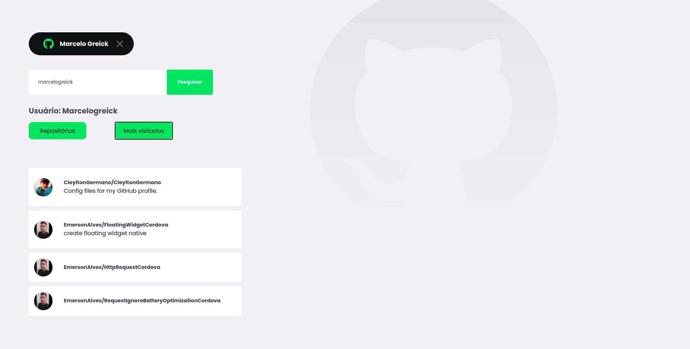

## Projeto

Teste desenvolvido para a [Uol] <br />

## Tecnologias utilizadas 🚀

<ul>
    <li><a href="https://reactjs.org/" target="_blank">React.js</a></li>
    <li><a href="https://nextjs.org/" target="_blank">Next.Js</a></li>
    <li><a href="https://sass-lang.com/" target="_blank">Sass</a></li>
</ul>


<br />



## Executar a aplicação

Em caso de download do projeto você precisará baixar as dependências:

**Necessário:** Yarn , utilize Yarn install

<ul>
 <li>Para iniciar o projeto, siga os passos abaixo:</li>
</ul>

```
1 - Primeiro abra no terminal a pasta do backend e execute yarn dev
2 - Dentro desta aplicação frontend execute yarn dev

O .ENV FOI ENVIADO NO GIT PARA FACILITAR A EXECUÇÃO
```
